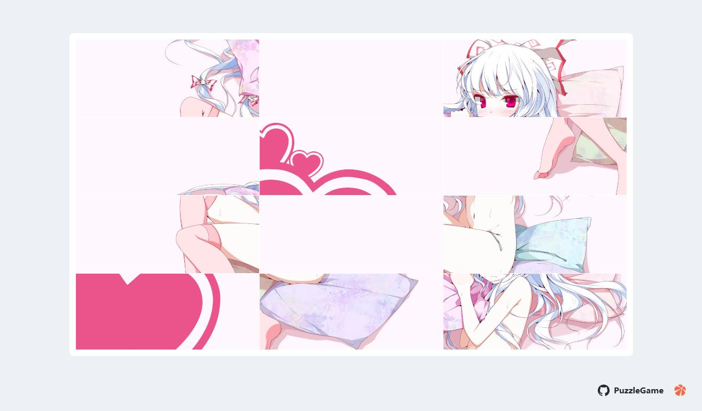

# 拼图小游戏（PuzzleGame）

一个基于 HTML/CSS/JavaScript 的图片拼图小游戏，支持难度选择、从 URL 加载图片、从 txt 列表轮换图片、下载当前图片等功能。界面包含左侧悬停侧边栏与底部居中控制面板。

> 弱化了游戏，主要还是菜，可以任意拖动！



## 功能特性

- 图片拼图：将图片切分为网格块，支持拖拽交换以完成拼图
- 难度选择：行数、列数可选（3/4/5）
- 图片来源：
  - 输入图片 URL 加载
  - 使用 `txt:` 前缀加载远程/同源 txt 文件，每行一个图片链接，自动轮换下一张
- 交互优化：
  - 左侧侧边栏（悬停时显示/展开/可点击里面的API使用）
  - 底部控制面板（鼠标悬停时出现）

## 页面结构概览

- `.image-container`：拼图网格容器（固定高度 580px，按图片纵向等比缩放宽度）
- `.btn-container`：难度选择与重新开始（底部居中，悬停/聚焦时显示）
- `.input-container`：图片 URL 输入与加载按钮（底部居中，悬停/聚焦时显示）
- `.sidebar`：左侧链接侧边栏（悬停时显示并展开）
- `.tip-container .tip-background`：完成提示框，含“下载图片”与“确定”按钮

## 使用方法

1. 打开 `index.html`
2. 在底部的“图片 URL”中输入图片地址或 `txt:` 列表地址：
   - 直接图片：如 `https://example.com/a.jpg`
   - 列表文件：如 `txt:https://example.com/list.txt`
     - txt 文件每行一个图片 URL
3. 点击“加载图片”
4. 使用难度选择中的“行/列”设置，点击“重新开始”重新切分
5. 拖拽拼图块交换位置，完成后弹出“提示”框
6. 在提示框点击“下载图片”可于新窗口打开当前这张完整图片（非拼图网格）


## txt 列表加载说明

- 在 URL 输入框填入 `txt:` 前缀链接，如：`txt:https://example.com/images.txt`
- txt 内容示例：
  ```
  https://example.com/a.jpg
  https://example.com/b.png
  https://example.com/c.jpeg
  ```
- 每次“加载图片”或内部逻辑轮换时，会按列表顺序切换下一张

## 下载当前图片的实现与限制

- 页面会记录：
  - `lastImageOriginUrl`: 输入的原始 URL（不含防缓存时间戳）
  - `lastImageLoadedUrl`: 实际加载后的图片地址（可能是跳转后的真实资源地址）
  - `lastImageBlobUrl`: 若跨域允许，会缓存图片 Blob 的对象 URL
- 点击“下载图片”时按以下优先级在新窗口打开：
  1. `lastImageBlobUrl`（最稳定，指向当前显示的图片二进制）
  2. `lastImageLoadedUrl`（浏览器解析后的最终地址）
  3. `lastImageOriginUrl`（原始输入）
- 说明：
  - 跨域（CORS）受限时，可能无法获取 Blob 或最终重定向地址
  - 但若 API 禁止跨域或重定向不可见，这一行为可能受限

## 致谢

- 本项目基于 [puzzle-game](https://github.com/mufeng510/puzzle-game/) 改进，感谢原作者的开源贡献。